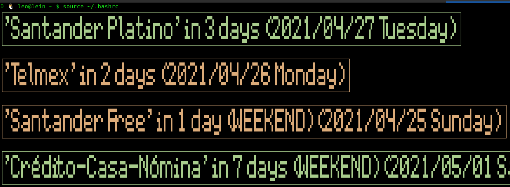

# shellreminders
Shows reminders in my terminal about things that I have to pay soon, like my credit cards ...

## Why am I doing this?
Because I spend a lot of time in the terminal, I can use my phone but I think that seeing this every time I open a terminal
and my ~/.bashrc is read will make me to remember better what I have to pay. This is how it looks when I open a terminal
emulator:



```
./shellreminders 
┌──────────────────────────────────────────────────────────┐
│'Santander Light' in less than 3 days (2019/5/26)         │
└──────────────────────────────────────────────────────────┘
┌──────────────────────────────────────────────────────────┐
│'Santander Free' in less than 6 days (WEEKEND) (2019/5/26)│
└──────────────────────────────────────────────────────────┘

0 [16:20]leo@lein ~/bin $ ./shellreminders 
```

Configuration (input) file:

```
$ cat ~/.shellreminder/reminders 
Santander Platino;18
Promotions;13

```
